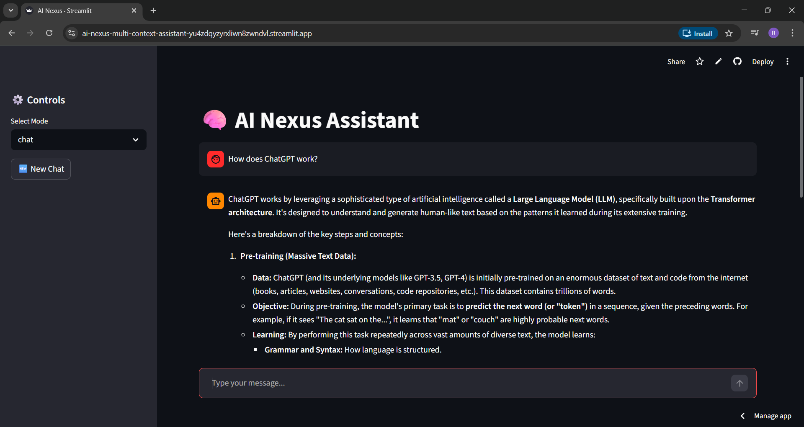
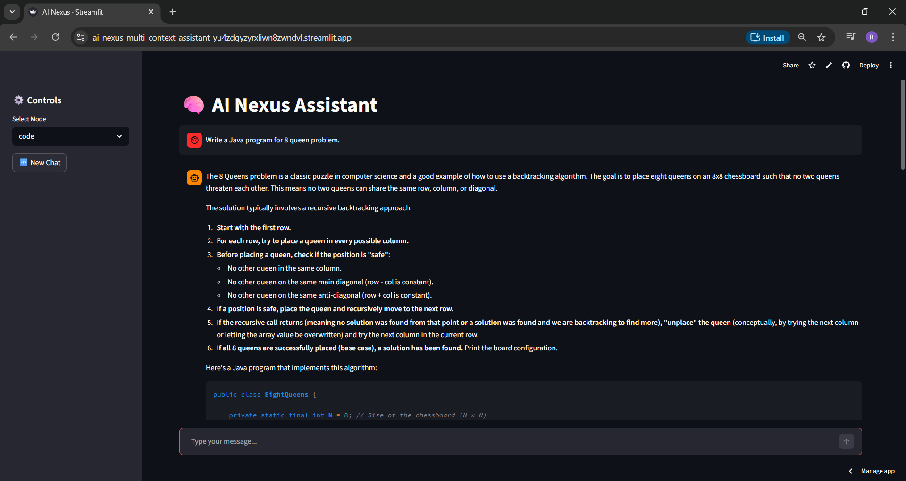
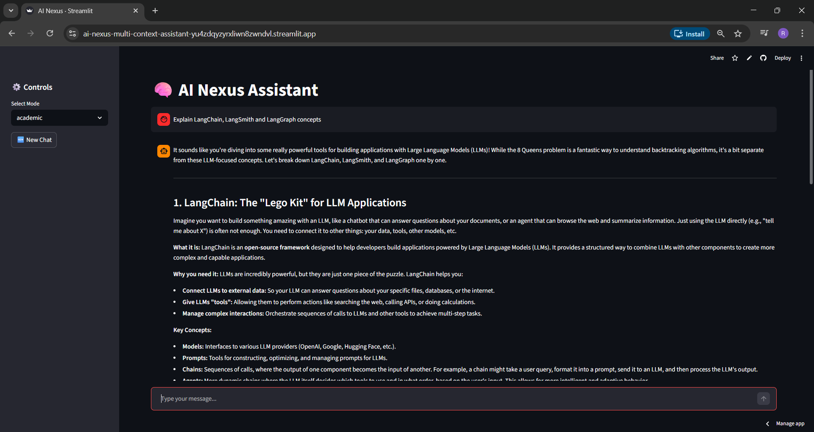
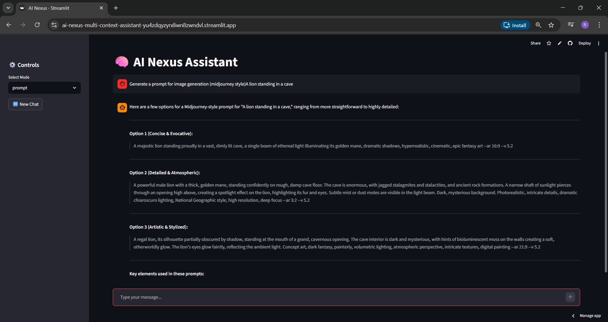
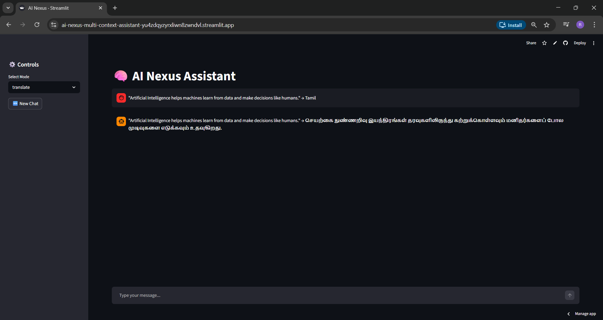

---


---

# 🧠 AI Nexus – Multi-Context AI Assistant

> 🚀 A powerful **multi-mode AI assistant** built using **LangChain + Gemini + Streamlit**

---

## 🌐 Live Demo

👉 https://ai-nexus-multi-context-assistant-yu4zdqyzyrxliwn8zwndvl.streamlit.app/

---

## 🧠 Overview

**AI Nexus** is an intelligent assistant that dynamically switches between multiple contexts:

- 💬 General Chat
- 💻 Code Generation
- 📚 Academic Explanation
- ✨ Prompt Engineering
- 🌍 Language Translation

It mimics a **real-world AI assistant (like ChatGPT)** with memory, context awareness, and multiple intelligent modes.

---

## ✨ Features

### 🔄 Multi-Context Modes

- 💬 **Chat Mode** → General conversation
- 💻 **Code Mode** → Generate & explain code
- 📚 **Academic Mode** → Concept explanations
- ✨ **Prompt Mode** → High-quality prompt generation
- 🌍 **Translate Mode** → Language translation

---

### 🧠 AI & Memory

- Uses **LangChain message types**:
  - `SystemMessage`
  - `HumanMessage`
  - `AIMessage`
  - `ToolMessage`
- 🧠 FAISS-based memory recall
- 💾 Stores chat history dynamically
- 🔄 Mode-based chat reset

---

### ⚡ Performance

- Powered by **Google Gemini (gemini-2.5-flash)**
- Fast and structured responses
- Context-aware answers

---

## 📸 Screenshots

### 💬 Chat Mode


---

### 💻 Code Mode


---

### 📚 Academic Mode


---

### ✨ Prompt Mode


---

### 🌍 Translation Mode


---

## 🧠 Tech Stack

| Technology        | Purpose                     |
|------------------|---------------------------|
| Streamlit        | Frontend UI               |
| LangChain        | LLM orchestration         |
| Google Gemini    | AI Model                  |
| FAISS            | Memory / Vector DB        |
| Python           | Core backend              |

---

## 📁 Project Structure

```bash
ai-nexus/
│
├── app/
│   ├── main.py        # Streamlit UI
│   ├── modes.py       # Mode logic
│   ├── memory.py      # FAISS memory
│   ├── llm.py         # Gemini model
│   ├── tools.py       # ToolMessage (calculator)
│
├── core/
│   ├── config.py      # API config
│   ├── prompts.py     # System prompts
│
├── assets/            # Screenshots
├── data/              # (optional FAISS storage)
├── requirements.txt
├── README.md
├── LICENSE

```
---

## ⚙️ Installation

### 1️⃣ Clone Repo
```bash
git clone https://github.com/22AD040/ai-nexus-multi-context-assistant.git
cd ai-nexus-multi-context-assistant
```

### 2️⃣ Create Virtual Environment
```bash
python -m venv venv
venv\Scripts\activate
```

### 3️⃣ Install Dependencies
```bash
pip install -r requirements.txt
```

---

## 🔐 Environment Setup

Create a `.env` file in the root directory:

```env
GOOGLE_API_KEY=your_api_key_here
```

---

## ☁️ Streamlit Secrets (Deployment)

Add the following in **Streamlit Cloud Secrets**:

```toml
GOOGLE_API_KEY = "your_api_key_here"
```

---

## ▶️ Run Locally

```bash
streamlit run app/main.py
```

---

## 🌐 Deployment

Deployed using **Streamlit Cloud**:

- GitHub integration  
- Secure secrets management  
- Automatic deployment  

---

## 🔒 Security

- 🔐 API keys stored in `.env` and Streamlit secrets  
- 🚫 `.env` excluded using `.gitignore`  
- ❌ No sensitive data exposed  

---

## 🎯 Use Cases

- AI Chatbot  
- Coding Assistant  
- Learning Assistant  
- Prompt Engineering Tool  
- Language Translator  

---

## 🚀 Future Improvements

- 🔄 Streaming responses  
- 🗑 Chat history management UI  
- 📊 Analytics dashboard  
- 🌍 Multi-language UI  
- 🤖 Tool integrations (search, APIs)  

---

## 👩‍💻 Author

**Ratchita B**  
🎓 AI & Data Science Student  
🚀 Generative AI Intern  

---

## ⭐ Support

If you like this project:

👉 Star ⭐ the repo  
👉 Share with others  

---

## 📜 License

MIT License

---